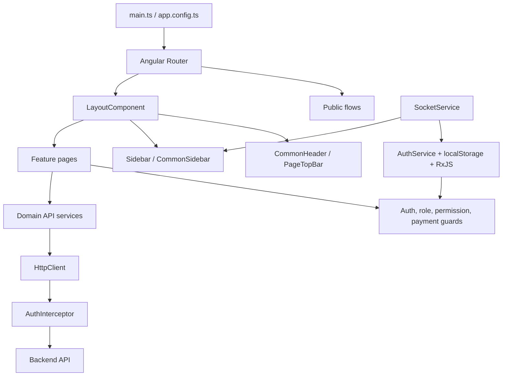

# Frontend System Architecture & UI Blueprint

## 1. Executive Summary

`ticketingSystem` is an Angular 19 single-page application for administering a multi-tenant ticketing and customer-support platform. The frontend is organized around:

- A shared authenticated `LayoutComponent` containing the header, sidebar, and routed page outlet.
- Feature folders for super-admin, admin/sub-admin, ticket-system configuration, customers, plans, checkout, login, and reporting.
- A large central route registry in `src/app/app.routes.ts`.
- Role-based and permission-based route guards backed by cached authentication state.
- Domain services that wrap REST-style API calls beneath `environment.apiUrl`.
- Standalone components for most pages, while `AppModule` remains as a compatibility/import container.
- RxJS observables and subjects for authentication, permissions, theme, sidebar preferences, loading/redirect state, and live permission updates.



## 2. Technology Stack & Application Structure

### Core platform

| Area | Implementation |
|---|---|
| Framework | Angular `^19.2` with TypeScript `~5.7.2` |
| Rendering model | Standalone components are the dominant page model; `AppModule` still imports browser, forms, Material, editor, and third-party modules |
| Routing | `@angular/router`; routes are declared centrally in `app.routes.ts` and provided through `provideRouter(routes)` |
| HTTP | `HttpClientModule` / `HttpClient`; domain services generally build URLs from `environment.apiUrl` |
| Async/state | RxJS `Observable`, `BehaviorSubject`, `Subject`, operators such as `map`, `catchError`, `filter`, `takeUntil` |
| Forms | Angular reactive forms (`FormGroup`, `FormBuilder`, `FormArray`, validators), with `FormsModule` used for simpler view state and filters |
| UI components | Angular Material, Bootstrap 5, `ngx-bootstrap`, Font Awesome, Bootstrap Icons, custom shared standalone components |
| Tables and pagination | Native/custom table views, `ngx-pagination`, shared `PaginationFooterComponent`, popup action menus |
| Charts/reporting | `ng2-charts`, Chart.js, `@swimlane/ngx-charts` |
| Editors/uploads | `ngx-editor`, `@swiftlyme/editor`, `@swiftlyme/image-uploader`, `@swiftlyme/color-spotter` |
| Notifications/loading | `ngx-toastr`, `ngx-ui-loader` |
| Payments | Razorpay client plus payment/order/subscription services |
| Files/reports | `xlsx`, `file-saver`, `jspdf`, `jspdf-autotable`, `pdfjs-dist`, CSV parsing |
| Realtime/notifications | `socket.io-client`, Firebase Cloud Messaging, Angular service worker/push notifications |
| Offline/runtime | Angular service worker enabled outside development; custom service-worker scripts exist under `src/` |

### Bootstrap and configuration

- [`src/main.ts`](src/main.ts) is the application entry point.
- [`src/app/app.config.ts`](src/app/app.config.ts) provides the router, animations, Angular Material date adapter, charts, `HttpClient`, Toastr, the `AuthInterceptor`, and the production service worker.
- [`src/app/app.module.ts`](src/app/app.module.ts) preserves module-based imports such as Material form fields/selects/dialogs, editor support, pagination, and image/color components. It has no declared components and acts primarily as an import/schema container.
- [`src/app/app.component.ts`](src/app/app.component.ts) and its template form the root shell around the router outlet.
- [`src/environments/environment.ts`](src/environments/environment.ts) and `environment.prod.ts` supply environment-specific API configuration.

### Folder boundaries

```text
src/app/
  login/                 Authentication and password flows
  super-admin/           Platform-level administration and reporting
  admin/                 Admin/sub-admin management and reports
  ticket-system/         Ticket setup, ticket lifecycle, templates, and events
  customer/              Customer management and import
  plans/                 Plans, features, payments, and payment history
  checkout/              Loading, checkout, confirmation, and expiry states
  includes/              Layout header, sidebar, preferences, and top bar
  shared/                Reusable page/table/filter/action components
  services/              Domain API, state, upload, realtime, and notification services
  permissions/           Permission assignment/table UI
  confirm-dialog/        Reusable Material confirmation dialog
```

## 3. Component & Page Index

Most business features follow a consistent `manage-*` list page plus `add-*` form page pattern. Detail/edit routes often reuse the add component with an `:id` parameter.

### Application shell and shared UI

- `LayoutComponent`: authenticated shell; coordinates theme application, sidebar preferences, current user, role data, route changes, and live permission refresh.
- `CommonHeaderComponent`: global header actions, including refresh events.
- `SidebarComponent` and `CommonSidebarComponent`: role/permission-aware navigation, active route highlighting, collapsed/mobile states, theme mode, expandable groups, and logout.
- `PageTopBarComponent`: reusable title, subtitle, back action, and configurable action buttons.
- `PageHeaderComponent`: reusable page heading and filter toggle.
- `FilterPanelComponent`: admin/role/sub-admin/date/model/activity filters with apply/clear events.
- `MultiSelectHeaderComponent`: bulk-selection actions.
- `PaginationFooterComponent`: page navigation and range summary.
- `PopupMenuComponent` and `ThreeDotsButtonComponent`: row-level action menus.
- `StatusToggleComponent`: reusable status switch.
- `ConfirmDialogComponent`: Angular Material confirmation dialog.
- `PermissionsTableComponent` and `GrantPermissionsComponent`: permission matrix and assignment workflows.

### Authentication and account flows

- `LoginComponent`: credential login and post-login routing.
- `RequestPasswordResetComponent`: public password-reset request form.
- `ForceChangePasswordComponent`: mandatory temporary-password change flow.
- `PasswordResetRequestsComponent`: review/manage pending reset requests.
- `ForgotPasswordComponent`: authenticated/admin password recovery form.
- `ActiveSessionsComponent`: active-session management.

### Super-admin pages

- Dashboard: `DashboardComponent`.
- Admins: `ManageSuperAdminAdminsComponent`, `AddAdminComponent`.
- Roles: `ManageRolesComponent`, `AddRolesComponent`.
- Permissions: `ManagePermissionsComponent`, `AddPermissionsComponent`, `ManageDefaultPermissionsComponent`, `ManageAdminPermissionsComponent`.
- Audit/monitoring: `UsersHistoryComponent`, `LoginDetailsComponent`, `ActivityDetailsComponent`, `ActivityLineComponent`.
- Reporting: lazy `ReportsDashboardComponent`.
- Plans/features: `ManagePlansComponent`, `AddPlansComponent`, `ManageFeaturesComponent`, `AddFeaturesComponent`.
- SMTP: `ManageSmtpConfigComponent`, `AddSmtpConfigComponent`.
- Themes: `ManageThemesComponent`, `AddThemeComponent`, `ChangeUserThemeComponent`.

### Admin and sub-admin pages

- `AdminDashboardComponent`.
- User management: `ManageAdminUsersComponent`, `AddSubAdminComponent`.
- Sub-admin permissions: `ManageSubadminPermissionsComponent`.
- Reports: lazy `ReportsAnalysisComponent`.

### Ticket-system configuration pages

Each item below has a manage/list component and an add/edit/detail component unless noted otherwise:

- Categories: `ManageCategoryComponent`, `AddCategoryComponent`.
- Sub-categories: `ManageSubCategoryComponent`, `AddSubCategoryComponent`.
- Complaint types: `ManageComplaintTypeComponent`, `AddComplaintTypeComponent`, lazy `ImportComplaintTypeComponent`.
- Priorities: `ManagePrioritiesComponent`, `AddPrioritiesComponent`.
- Projects: `ManageProjectsComponent`, `AddProjectsComponent`.
- SLAs: `ManageSlasComponent`, `AddSlasComponent`.
- Statuses: `ManageStatusComponent`, `AddStatusComponent`.
- Complaint modes: `ManageComplainModeComponent`, `AddComplainModeComponent`.
- Ticket types: `ManageTicketTypeComponent`, `AddTicketTypeComponent`.
- Tickets: `ManageTicketComponent`, `AddTicketComponent`, `TicketDetailsComponent`.
- Escalation matrix: `ManageEscalationMatrixComponent`, `AddEscalationMatrixComponent`.
- Event triggers: `ManageEventTriggerComponent`, `AddEventTriggerComponent`.
- Email templates: `ManageEmailTemplateComponent`, `AddEmailTemplateComponent`.
- SMS templates: `ManageSmsTemplateComponent`, `AddSmsTemplateComponent`.
- WhatsApp templates: `ManageWhatsappTemplateComponent`, `AddWhatsappTemplateComponent`.
- Public ticket intake: `AddOpenTicketComponent`, `ThankYouComponent`.

### Customer, plan, and checkout pages

- Customers: `ManageCustomerComponent`, `AddCustomerComponent`, lazy `ImportCustomerComponent`.
- Plans: `ManagePlansComponent`, `AddPlansComponent`, `PlanPaymentHistoryComponent`, `PlanPaymentComponent`.
- Checkout: `LoadingPageComponent`, `CheckoutPageComponent`, `PaymentConfirmationComponent`, `SubscriptionExpiredComponent`.
- Public tracking: `TicketDetailsComponent` is also used by `track-status` routes.

## 4. Routing & Access Control

### Route organization

The complete route table is in [`src/app/app.routes.ts`](src/app/app.routes.ts). It has four broad layers:

1. **Public/auth routes**: `/login`, `/password-reset`, `/feedback`, `/feedback/thank-you`, `/track-status`, and public checkout/payment result screens.
2. **Password/session transition routes**: `/set-password`, `/active-sessions`, `/loading-redirect`.
3. **Authenticated layout routes**: the empty-path route mounts `LayoutComponent`, then exposes all dashboard and management pages as children.
4. **Fallback routes**: empty path and wildcard redirect to `/login`.

### Lazy loading

The app uses standalone component lazy loading with `loadComponent` for:

- `/super-reports` -> `ReportsDashboardComponent`.
- `/reports` -> `ReportsAnalysisComponent`.
- `/import-customer` -> `ImportCustomerComponent`.
- `/import-complaint-type` -> `ImportComplaintTypeComponent`.

The remaining route components are statically imported in `app.routes.ts`, so the route registry is also a significant eager bundle boundary.

### Guards

| Guard | Responsibility |
|---|---|
| `AuthGuard` | Requires a token; otherwise navigates to `/login`. Used for `/set-password`. |
| `LoginAuthGuard` | Prevents an already authenticated user from returning to `/login`; redirects super-admins to `/dashboard`, other users to `/user-dashboard`, and users who must change password to `/set-password`. |
| `SuperAdminAuthGuard` | Requires a token and `roleCode === 'super_admin'`. |
| `AdminAuthGuard` | Requires token and role; prevents super-admin access to admin routes unless `data.allowSuperAdmin` is set. |
| `SubAdminPermissionGuard` | Reads a single exact permission from `route.data.permission`; allows explicitly configured super-admin exceptions and redirects unauthorized users to `/user-dashboard` with a Toastr warning. |
| `ForcePasswordChangeGuard` | Applied as `canActivateChild` to the layout route to enforce the password-change state across authenticated child routes. |
| `paymentStatusGuard` | Resolves loading/payment state before admin pages. It routes to dashboard, checkout, subscription-expired, or login and stores redirect/payment data. |
| `CanDeactivateGuard` | Protects unsaved forms on selected add/edit pages. |

### Permission-aware navigation

`CommonSidebarComponent` receives navigation models from `sidebar-nav.model.ts`, subscribes to `AuthService.permissions`, and hides items or children whose permission is absent. It also tracks active routes, nested expansion, collapsed popups, mobile state, and theme preferences. This creates two layers of access control:

- **Navigation visibility**: the sidebar hides unavailable features.
- **Route enforcement**: guards still reject direct URL access.

`LayoutComponent` additionally listens for Socket.IO permission-update signals, fetches fresh permissions, displays a persistent notification, applies them after user action, and redirects away from a route that is no longer authorized.

## 5. Services & API Integration

### Authentication, session, and state services

- [`AuthService`](src/app/auth.service.ts): login/logout, token and role storage, JWT expiration checks, permission APIs, password APIs, shared HTTP helper, theme state, cross-tab storage handling, and Socket.IO connection lifecycle.
- `AuthInterceptor`: adds bearer tokens to non-public requests, forwards `x-geo-location` and `x-user-ip`, logs errors, and invokes logout on non-public `401` responses.
- `SessionActivityService` and `session.activity.service.ts`: route/session activity logging.
- `UserSessionService`: user-session API operations.
- `SocketService` (`socketpermission.service.ts`): live permission-update channel.
- `LoadingService`: payment/loading decision API used by `paymentStatusGuard`.
- `RedirectStateService`: transient checkout/expiry redirect payloads.
- `PublicIpService`: public IP lookup used for request context.

### Domain API services

The following services wrap backend resources and commonly construct headers with the locally stored bearer token:

- Administration and identity: `AdminService`, `UserService`, `RoleService`, `PermissionService`.
- Ticket configuration: `CategoryService`, `SubCategoryService`, `ComplaintTypeService`, `ComplaintModeService`, `PriorityService`, `StatusService`, `SlaService`, `ProjectService`, `TicketTypeService`, `EscalationMatrixService`.
- Ticket and customer workflows: `TicketService`, `CustomerGroupService`, `OpenTicketService`, `MessageTrailService`.
- Communication: `EventsService`, `EmailTemplateService`, `SmsTemplatesService`, `WhatsappTemplatesService`, `SmtpConfigService`.
- Plans and billing: `PlansService`, `FeaturesService`, `PlanAccessService`, `PaymentService`, `RazorpayService`.
- Reporting: `ReportService`, `ReportSuperService`, `SuperAdminDashboardService`.
- Files and media: `UploadService`, `S3HelperService`.
- Themes/preferences: `ThemeConfigurationService`, `ThemeConfigService`, `UserPreferencesService`, `SidebarThemeService`.
- Notifications: `FirebaseService`, `NotificationService`, `PushNotificationService`.

### HTTP and error flow

The normal request path is:

1. A component calls a domain service, or in a few legacy screens calls `HttpClient` directly.
2. The request is sent through `AuthInterceptor`.
3. The interceptor adds authorization/context headers unless the URL is considered public.
4. `401` triggers centralized logout; `403` is logged as an insufficient-permission warning.
5. Components generally handle response state, Toastr feedback, loading indicators, and navigation locally.

There are two API URL conventions in the codebase: most services use `environment.apiUrl`, while public/open-ticket services use `environment.apiUrls`. This distinction should remain documented when adding endpoints.

## 6. Key Engineering Highlights

### Reactive forms and validation

Reactive forms are used extensively across login, password changes, user/admin management, customers, plans, tickets, templates, SMTP, themes, escalation matrices, and ticket configuration. Common patterns include:

- `FormBuilder`-constructed forms with required, length, pattern, and custom validation rules.
- `FormArray` for repeatable plan or escalation entries.
- Reuse of add components for create, edit, and view modes based on route parameters.
- `CanDeactivateGuard` on higher-risk unsaved forms.
- `ngx-editor`/custom editor components for rich message/template fields.
- `NgSelectModule`, image uploaders, color selection, and file import controls for specialized inputs.

### Reusable UI composition

The shared components establish a consistent management-console interaction model: page header, filter panel, table/list, row action menu, status toggle, bulk action header, and pagination footer. Material dialogs provide confirmations and other modal workflows. `@Input`/`@Output` contracts keep these controls reusable across super-admin, admin, customer, and ticket screens.

### State handling

- Authentication state is represented by `BehaviorSubject`s for token, role, role code, admin ID, name, status, permissions, forced-password state, and theme.
- Persistent state is mirrored to `localStorage`, allowing refresh recovery and cross-tab token/role updates.
- `UserPreferencesService` manages sidebar collapse, mobile sidebar state, theme mode, density, border radius, font scaling, and reduced motion.
- `ThemeConfigService` and `SidebarThemeService` apply theme configuration to the document/UI.
- `Subject` + `takeUntil`/subscription cleanup patterns appear in dashboard/report and live-update components.
- `RedirectStateService` avoids putting complex payment state directly into route URLs.

### Reporting and data-heavy screens

Dashboards and reports use Chart.js/ng2-charts and Swimlane charts. Activity and report screens support multi-dimensional filtering, date ranges, role/admin/sub-admin selection, model/activity filtering, export/download services, and paginated data presentation.

### Realtime and push features

Socket.IO is used for permission-update signals so a changed access grant can be reflected without a full login. Firebase messaging and Angular service-worker support provide browser notification infrastructure. The authentication service connects/disconnects the socket along with login/logout.

### Custom pipes/directives assessment

No custom `*.pipe.ts` or `*.directive.ts` files were found under `src/app`. Formatting and interaction behavior are implemented through component methods, Angular built-in directives/pipes, shared components, service state, and third-party UI modules.

## 7. Architectural Risks and Maintenance Notes

- The route table is large and mostly eager. Additional feature areas would benefit from feature-level route files and broader lazy loading.
- Several components call `HttpClient` directly while parallel domain services exist; consolidating API access would make error handling and headers more uniform.
- Authentication data is stored in `localStorage`; this is convenient for refresh/cross-tab behavior but increases the impact of an XSS vulnerability.
- Permission identifiers are stringly typed in route metadata, sidebar models, and storage. Shared constants or typed route data would reduce drift.
- `AppModule` and standalone/provider configuration coexist. A future cleanup could choose one primary bootstrapping model and remove duplicate imports/providers.
- Guard redirects are imperative in several places. Returning `UrlTree` consistently would make navigation decisions easier to test.
- `any` is common in service responses and form models; typed DTOs would improve API contract safety.

## 8. Useful Entry Points for Further Work

- Routing and access rules: [`src/app/app.routes.ts`](src/app/app.routes.ts)
- Authentication state and API helper: [`src/app/auth.service.ts`](src/app/auth.service.ts)
- Request interception: [`src/app/auth.interceptor.ts`](src/app/auth.interceptor.ts)
- Application providers: [`src/app/app.config.ts`](src/app/app.config.ts)
- Authenticated shell: [`src/app/layout/layout.component.ts`](src/app/layout/layout.component.ts)
- Permission-aware navigation: [`src/app/includes/common-sidebar/common-sidebar.component.ts`](src/app/includes/common-sidebar/common-sidebar.component.ts)
- Shared management UI: [`src/app/shared/`](src/app/shared/)
- API service catalog: [`src/app/services/`](src/app/services/)
